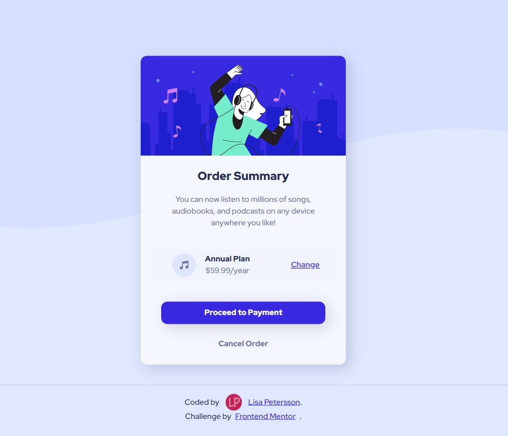

# Order summary card solution - Frontend Mentor

This is a solution to the [Order summary card challenge on Frontend Mentor](https://www.frontendmentor.io/challenges/order-summary-component-QlPmajDUj).

## Table of contents

- [Overview](#overview)
  - [The challenge](#the-challenge)
  - [Screenshot](#screenshot)
  - [Links](#links)
- [My process](#my-process)
  - [Built with](#built-with)
  - [Continued development](#continued-development)
- [Author](#author)

## Overview

### The challenge

Users should be able to:

- See hover states for interactive elements

### Screenshot

### Links

- Solution URL: [Solution](https://your-solution-url.com)
- Live Site URL: [Live site](https://lisapetersson.github.io/order-summary-card-challenge/)

## My process

### Built with

- CSS custom properties
- Flexbox

### Continued development

In future projects I want to work on refining my media-queries and positions skills. 

## Author

- Website - [Lisa Petersson](https://www.lisapetersson.se)
- Behance - [@lisapetersson](https://www.behance.net/lisapetersson)
- Twitter - [@LisaBKPetersson](https://twitter.com/LisaBKPetersson)
- Frontend Mentor - [@LisaPetersson](https://www.frontendmentor.io/profile/LisaPetersson)

